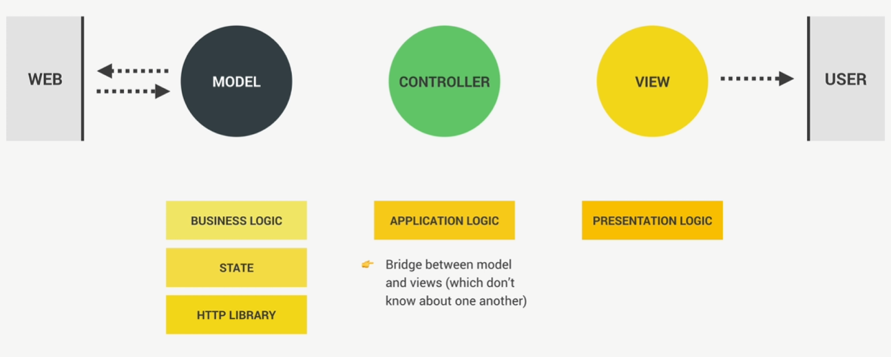

# Nasa Mars Photo Explorer

```
Put your front-end skills to the test by building a JavaScript-based interface powered by NASA’s Mars Rover Photos API.

🔧 Requirements
Use vanilla JavaScript only (no frameworks like React, Vue, Angular)
Do not use Bootstrap or similar CSS frameworks
Avoid using jQuery
The application must be fully responsive, working across desktops, tablets, and smartphones

🚀 Getting Started
Sign up for a free NASA API key at https://api.nasa.gov/
Review the Mars Rover Photos API documentation available on the same page

📸 Project Overview
Create a simple yet elegant photo gallery that allows users to search and view images taken by NASA's Mars rovers.

1. Build a Search Form
Design and implement a responsive form that lets users query the photo database.
Required Fields:
  Date range (Earth date – from/to)
  Rover (multi-select)
  Camera (multi-select – include only the 3 common to all rovers)

2. Display Search Results
Once a search is submitted:
  Fetch results from the NASA API
  Render the results in a paginated or lazy-loaded grid
  Each result should include:
  A thumbnail image
  The date the photo was taken
  The name of the rover

3. Full-Size Image View
Clicking on a thumbnail should open the photo in a modal or fullscreen view for a closer look
```

## Requirements to run project

1. .env file

```ini
VITE_API_KEY="****************************************"
```

2. npm install & run start script
```bash
npm install
npm start
```

## Architecture Overview - MVC in Vanilla JavaScript

This project follows a Model-View-Controller pattern, inspired by modern frontend practices.
This lightweight MVC structure helps separate responsibilities.



- Model (model.js)
  1. Manages application state
  2. Handles data fetching
  3. Normalizes API data for views.

- View (View.js & subclasses GalleryView, ModalView, etc...)
  1. Each UI component has it's own View class.
  It seemd appropriate for views to be encapsulated as classes.
  2. Views handle DOM rendering, markup generation using template literals, UI event listeners.

- Controller (controller.js)
  1. Acts as the central hub.
  2. Get data to update state, initiates re-render of view.